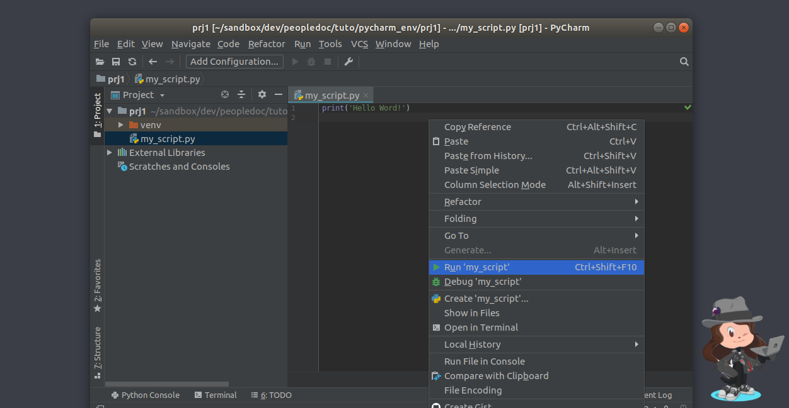
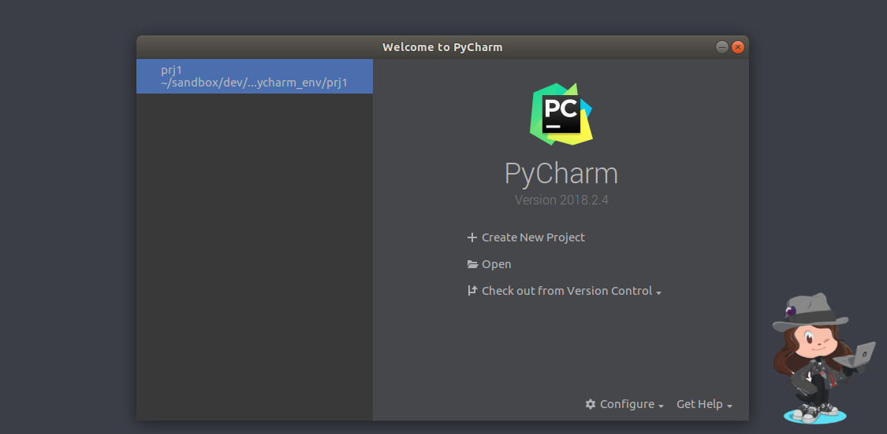
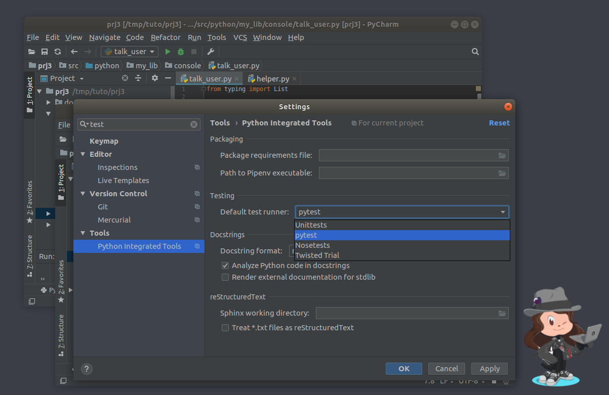

PyCharm Python Dev Environment
==============================

---

Needed resources
----------------

- [PyCharm Community Edition](https://www.jetbrains.com/pycharm/download/download-thanks.html?platform=linux&code=PCC) 
- virtualenv

> Note this tutorial is elaborated on Ubuntu 18.04
---

Install PyCharm
----------------   

    mkdir ~/pycharm
    tar xzvf ~/Downloads/pycharm-community-*.tar.gz -C ~/pycharm/
     ~/pycharm//pycharm-community-*/bin/pycharm.sh
----

----

----

----

----

---

Install Virtualenv
------------------

    sudo apt-get install virtualenv
    
---

Create a New Project
-----------------------

Click on **+ Create New Project**

----

Set the **Location** path && Create a new **virtualenv**

----

The Project is Created. 

----
Display the Toolbar:

----
### Create a New Python File

    => Right click on prj1 
           => New
                => Python File

----
Use name **"my_script"** (the .py extension is automatically added for Python Files) 

----

Python file : **my_script.py** is created

----
### Run The Script

    Right click inside the script (or on teh file name)
        => Run 'my_script'
        

----

----

----
### Close The Project

    File 
      => Close Project

Then now **prj1** is in quick access in the main page.

---

Import an existing project
--------------------------

Download [sources](https://drive.google.com/file/d/1EMRsLkobZ-WtfZd69kMiqkaouPL3fgmA/view?usp=sharing) 
and extract them

----
Create a *virtualenv* then activate it

        cd [extracted source directory]
        virtualenv venv -p /usr/bin/python3
        . ./venv/bin/activate

----
Open the project in *Pycharm*:
- From the main page: click on **Open**
- From an opened project: click on **File => Open**

----
Run *my_script.py*

**Error :**  ModuleNotFoundError: No module named 'yaml'

----
See /my_lib/loader/specific/yaml_loader.py

       

----

A module is missing. All needed project modules should be specified
in a `requirement.txt` file.

Install requirement in current virtual env using `requirement.txt`:

    
 
----
Run *my_script.py*

Everything works!

---

Import an existing project - Case 2
-------------------------------------

1. Download [sources](https://drive.google.com/file/d/1ZJdzXBNrmdYjxNSKxzMM7TeoNp9fRnmA/view?usp=sharing) 
and extract them

2. Create a *virtualenv* then activate it

        cd [extracted source directory]
        virtualenv venv -p /usr/bin/python3
        . ./venv/bin/activate

3. Open the project in *Pycharm*:
    - From the main page: click on **Open**
    - From an opened project: click on **File => Open**

----

----

There is import errors, but **HowOldAreYouPlugin** exists in 
    *various/python/plugin/display/how_old.py*

----
### Set The Project Structure

- Open Settings

----

- Select **Project: prj3**

----

- Check if the interpreter is the right one.

----
- Set the project structure

The **Python structure** must be set to declare which directories are **Python modules**.
It has a direct impact on **Python imports**.
 
Helper: See [python import example](https://drive.google.com/file/d/1Bj3M-XdiQwmRF2vw9X4BLwlZupF4qECa/view?usp=sharing)
   
----
- Select a source directory. 

It must be the first parent of the top python module.Apply then Ok.

----

----

Plugin imports seem to be resolved but they are remaining issues with helpers.
Find the solution without modifying imports in source files.

---

Existing Project With Tests
---------------------------

1. Download [sources](https://drive.google.com/file/d/1wIZYRVbMfCooZhJ6m0wdVoUFzhIXhrCx/view?usp=sharing) 
and extract them

2. Create a *virtualenv* then activate it

        cd [extracted source directory]
        virtualenv venv -p /usr/bin/python3
        . ./venv/bin/activate

3. Open the project in *Pycharm*:
    - From the main page: click on **Open**
    - From an opened project: click on **File => Open**

----

----
### Setup test runner

Open **Settings** then search 'test'

----

In **Python Integrated Tools** set **pytest** as *Default test runner*

----
Run tests

    Right click on file name => Run 'pytest in test_find_...'

----
The tests fail! 

    It also possible to run one test function:
        Right click on test function => Run ...
    
----
### Use the debugger

Add a breakpoint in the first test (line 9)

----
Run in debug mode.

    The whole file: 
     Right click on file name => Debug 'pytest in ...'
    
    A function: 
     Right click inside the function =>  Debug 'pytest in ...'
    
----
Click on the icon which seems to be glasses in the middle of the debug section.

----

| Left  | Middle   | Right |
|---|---|---|
|execution stack | current variables | inspector |

----
Step Over the statement

----
Step Into the function

----
You can inspect expression

----

----
 Use the debugger to fix the code!
 All tests must succeed.